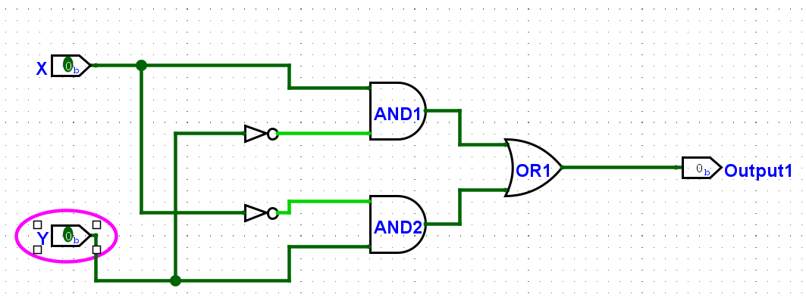
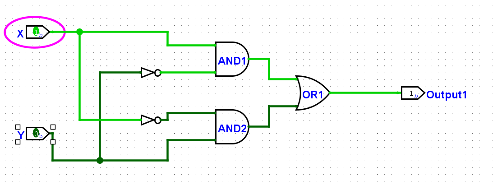
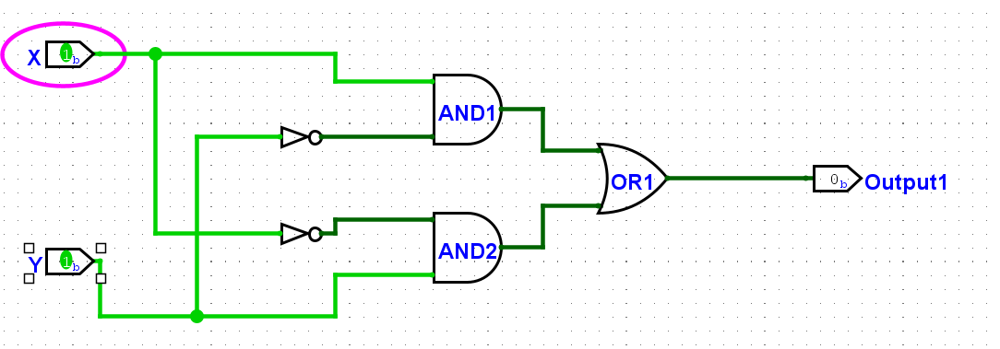
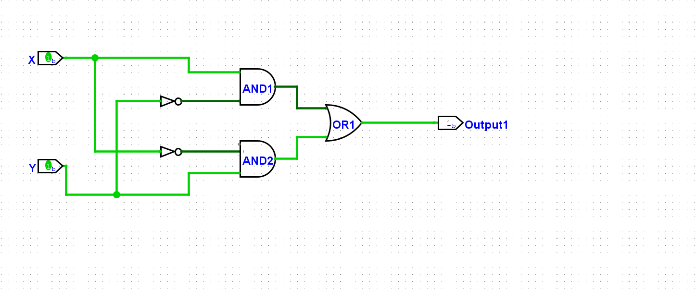
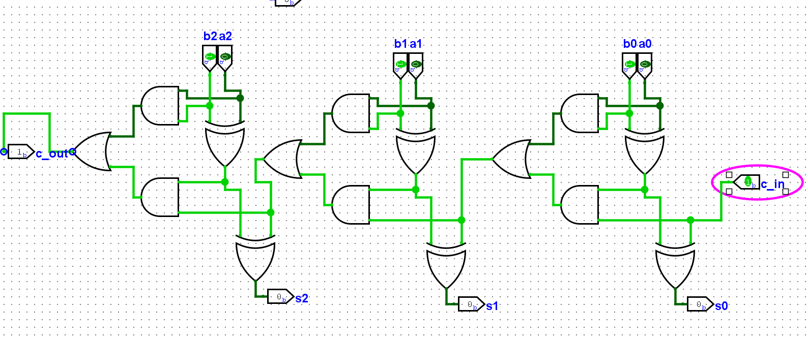
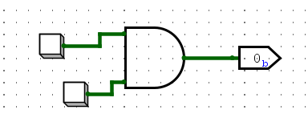
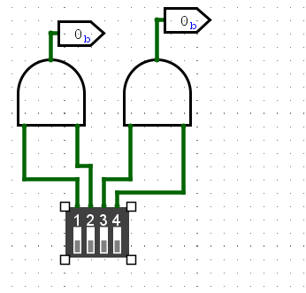
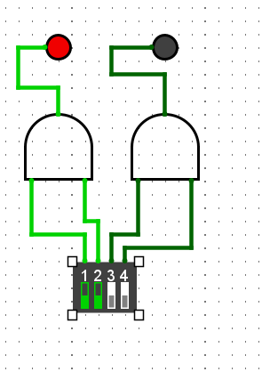
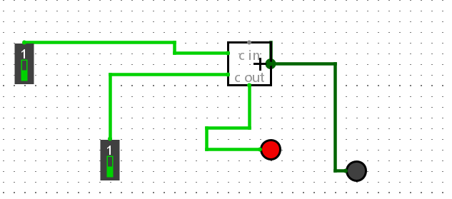
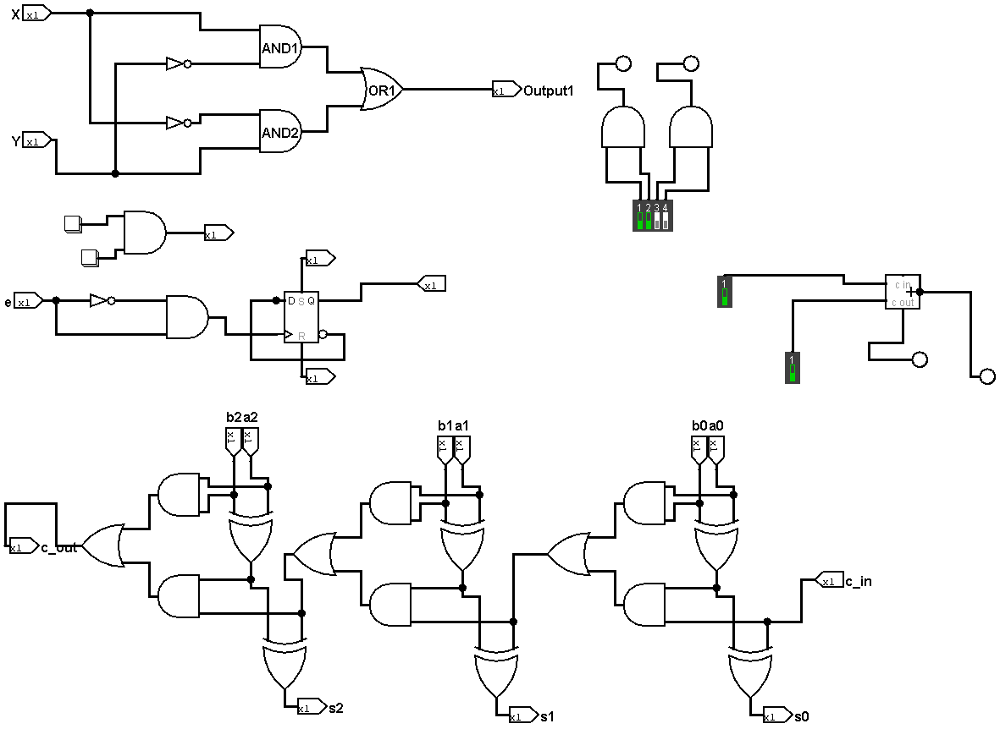

## F.2.3.2
### 阅读logisim官方的教程文档
#### 完成对于XOR 电路的绘制
**首先是 x = 0 , y = 0 ;**
 
**X = 1, Y=0**

**X = 0, Y = 1**

**X = 1,Y = 1**

**在上述的绘制过程中还发现各个元件的电路接入位置是有要求的，不能随意改变**
**下图即是错误的接入**

**错误的接口在*AND2*处**

#### 了解单步调试的过程
我发现在我的logisim模拟中的 Ctrl+l组合键不能使用，为此我使用的是**直接点击“模拟”选项中的“信号单步传播”的选项**
**测试的流程是先Ctrl+E将自动模拟关闭，之后就是不断点击模拟”选项中的“信号单步传播”的选项，观察线路颜色的变化**
测试图如下：

## F2.3.3 和F2.3.4
1. 对于**图形界面**简单浏览了，因为在绘制上述的电路图时，已经对于图形界面有意一定的了解。
2. **菜单参考**：
   **找到了在我的logisim版本中的“导出图像”，“汇编查看器”，“分析电路”，“获取电路统计信息”，“加载库” 等选项**，不过在我的加载库中只有一个能够加载。
3. **输入元件: Button(按钮), Dip Switch(拨码开关)**
   
   1. **Button**： 当按下鼠标按钮时，组件的输出将为 1。释放鼠标按钮时，输出将恢复为 0。不过我还发现可以在**状态栏中的属性中来改变它的按下逻辑**。
      
      

   2. **Dip Switch**:Dip Switch 作为一个输入组件接入电路。它用于提供一个可操作的开关状态，模拟用户的输入。
      每个开关的状态（开或关）相当于一个 二进制输入信号。它可以外接其他电路元件,**只有在点击“更改回路内的值”这个按键之后，在点击 Dip Switch中的小按钮，才会变化输入输出。**
      
      

附：我的logisim中Dip Switch不能查看参考资料，是使用AI来解释说明怎么使用的。

4. **输出元件: LED, 7-Segment Display(7段数码管)**
   
   1. **LED**:根据输入是 1 还是 0，通过对 LED 进行着色（由其 Color 属性指定）来显示其输入的值。
      使用方法如下：
      
      
   
   2. **7-Segment Display**:显示其八个一位输入的值，跟LED的呈现形式作用很相似。

**实现一位加法器：**

完成的练习图如下：

