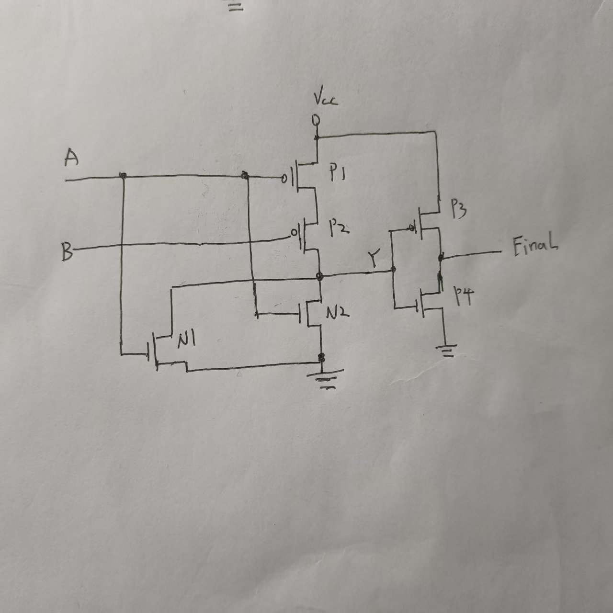

## 通过晶体实现0和1
### CMOS


说明：
1. 在A点加入高电压时，由于下方的nMOS是接地的，所以下方的nMOS管的栅极和源极电压相差大，
   下方的nMOS连通，同理上方的pMOS管截止，故Y点电压低
2. 在A点加入低电压是，由于下方的nMOS管的特性，栅极和源极之间的差值很小，故下方的nMOS管
   是截止的，同理上方的pMOS管是连通的，故Y点与上方的电源相连接，为高电压。


**感悟：我明白了，对于栅极施加的电压实际上并不会传入到电路中，**
      **它只是一个是否将电源电压传导到其他电路的条件。**

所以将与非门的输出连接到非门的输入就会实现 **与门** ，如下图所示


```bash
问题一：尝试分析以下电路的行为和功能
```


```bash
当 A = 0，B= 0时：
P1接通，P2接通，Y=1
当 A = 1，B= 0时，
P1截止，P2截止，N1接通，N2截止，故 Y=0
当 A = 0，B = 1时，
P1接通，P2截止，N1截止，N2连通，故Y=0
当 A = 1，B = 1时，
N1接通，N2接通，故 Y = 0,
总结：
只要 A，B两个参数有一个为1，Y都为0，即（或非门）
```

```bash
问题二：为或门绘制电路图
```
由于我们已知了或非门和非门的架构，所以只需要将或非门的输出作为非门的输入即可



```bash
问题三：对比两种实现的晶体管的数量
```

**新型实现** **三输入与非门**


```bash
回答：1.使用一个两输入与门和一个两输入与非门来搭建一个三输入与非门
      需要10个MOS管
      2。使用新型实现只需要6个MOS管

