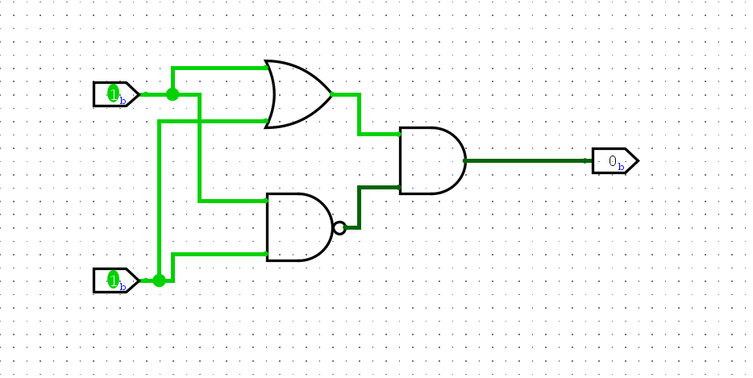
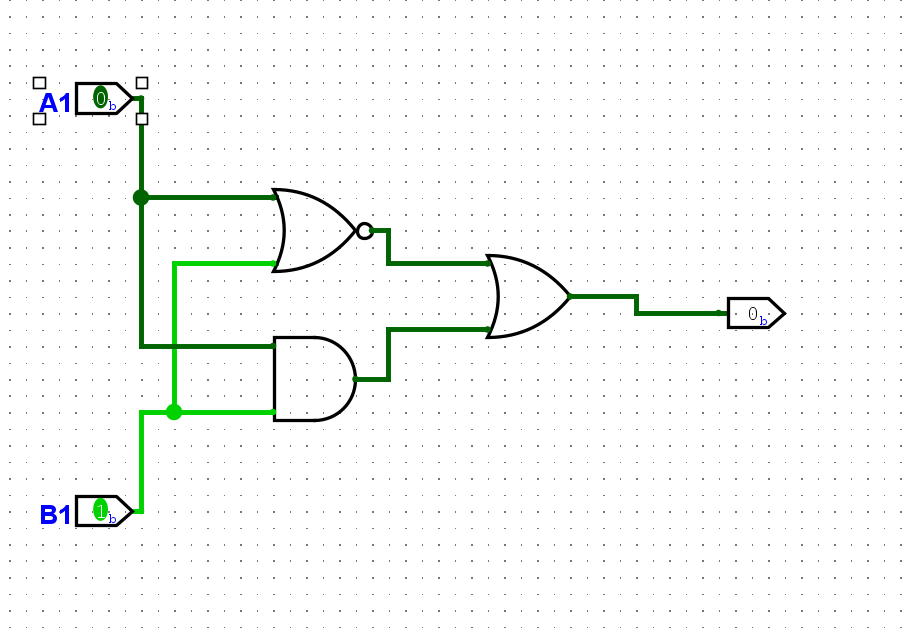

## 数字逻辑基础

### 通过晶体管来搭建门电路
#### 异或门
异或门的逻辑为，对于输入而言，相同为0，不同为1
即 
| A | B | Y |
|:---|:----|:---|
| 1 | 1 | 0|
|1 | 0 | 1|
|0 | 1| 1| 
|0 | 0 | 1|

而且有了真值表就可以将电路逻辑转换为数学的表达式
就以上述的异或操作为例：
1. 考虑真值表中输出为1的条目，对这些条目进行逻辑描述
2. A = 0, B = 1,和 A = 1,B = 0这连个组合在一起
3. 转换为逻辑表达式 ~A&B 和 A&~B
4. 这两个其中一个成立结果都成立，所以使用或操作拼接在一起

#### 异或门作业
```
异或门作业
在Logisim中使用基础的门电路来搭建一个异或门，搭建后，通过仿真检查方案是否正确，计算方案使用了多少晶体管
```


由上述的内容可知：
使用的晶体管数量
| 非门|与非门|或非门|
|:--:|:--:|:--:|
|2|4|4|
```
故可知我上面使用的晶体管数量刚好是14个
```
#### 同或门作业
```
设计一种同或门，当输入A和B相同时，结果为1，否则为0，
```
```
分析：
异或的数学表达式为：~(A&B)&(A|B)
所以将上述表达式取反为：(A&B)|~(A|B)
```

使用的晶体管数量依然为14个